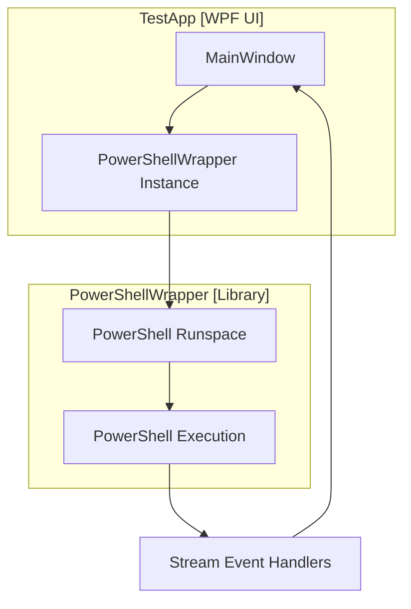

# PowerShellUiSampler System Patterns

## Architecture Overview
The PowerShellUiSampler follows a clear separation of concerns with two main components:

## Key Components

### PowerShellWrapper
1. **Core PowerShell Integration**
   - Manages PowerShell runspace creation and disposal
   - Provides methods for script execution
   - Handles PowerShell output streams
   - Implements IDisposable for proper resource cleanup

2. **Execution Models**
   - Synchronous execution with `InvokeSynchronous`
   - Asynchronous execution with `Invoke` (Task-based)
   - Script file execution with `InvokeScriptFileSynchronous`

3. **Cancellation Support**
   - Integrates with .NET's CancellationToken pattern
   - Provides method to stop running PowerShell operations

### TaskExtensions
1. **Cancellation Handling**
   - Extension methods for Tasks to handle cancellation
   - Integration between CancellationToken and PowerShell's Stop method
   - Proper exception propagation and handling

### TestApp (WPF UI)
1. **MainWindow**
   - Tab-based interface for different execution scenarios
   - ListBox for displaying PowerShell output with color coding
   - Progress bar for operation feedback
   - Buttons for script execution and cancellation

2. **PowerShell Output Handling**
   - Separate handlers for different PowerShell stream types
   - Color-coded output display
   - Thread-safe UI updates via Dispatcher

## Design Patterns

### Wrapper Pattern
The PowerShellWrapper class encapsulates and simplifies interaction with the PowerShell API, hiding the complexity of runspace management and PowerShell invocation.

### Factory Pattern
The PowerShellWrapper constructors act as factories for creating configured PowerShell environments, including the ability to pre-load modules.

### Observer Pattern
The PowerShell streams implement an observer pattern via .NET events, with the UI subscribing to these events to display output.

### Async/Await Pattern
The wrapper leverages Task-based asynchronous programming for non-blocking PowerShell execution.

### Disposable Pattern
Both the PowerShellWrapper and underlying PowerShell resources implement IDisposable for proper resource management.

## Threading Model
- Synchronous operations run in the calling thread
- Asynchronous operations use Task-based parallelism
- UI updates are marshaled to the UI thread via Dispatcher.Invoke
- Cancellation is implemented with CancellationToken and task coordination

## Error Handling
- PowerShell errors are captured through the Error stream
- .NET exceptions are caught and displayed in the UI
- Cancellation is handled gracefully with proper cleanup
- UI remains responsive even during errors or cancellation
